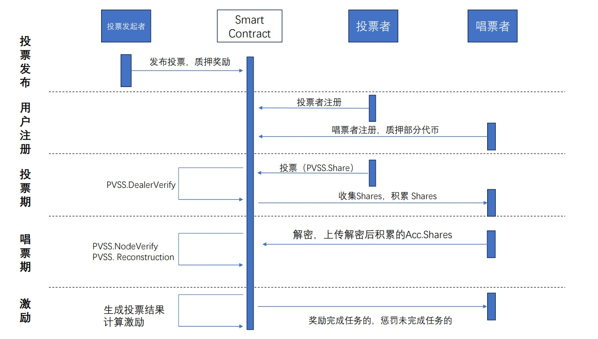

# PVSSVoteScheme base on Ethereum
一个基于以太坊的PVSS激励型电子投票系统，该系统可适用于去中心化的自治公司DAO(Decentralized Autonomous Corporations)下的电子投票场景。

我们使用PVSS（Publicly Verifiable Secret Sharing）密码原语来保证投票者每次投票的有效性以及每位唱票者所累积份额的有效期，从而保证了整个投票结果的正确性。

我们在智能合约上实现了对每次投票和累计投票份额的自动验证，并实现了链上投票结果的自动计算。

## 系统架构


## 案例示范
投票发起者通过在智能合约上调用 :
```java  
Contract.functions.new_vote("content",account,fee,t)
   ```
   发起一场投票，其中“content”是投票所提出的内容，account是投票发起的账户，fee表示投票的奖励，t是此次投票所需的最少唱票者(Tallier)。

然后有9位参与者1~9，质押自己对应的资产并注册成为唱票者(Tallier)
```java  
TallierRegister(1,9)   
   ```
  随后我们选择20名投票者发起投票(10~30)
   ```java  
VoterCastVote(10,30)    
   ```
当所有投票者投完票，并通过了选票验证，他们的投票份额将被唱票者们所下载，进行一个链下的累加（acc）。
完成累加后，唱票者提交进行对份额进行解密然后提交累加份额到智能合约上，智能合约完成验证并收集累加份额acc。当满足t个有效的累加份额后，智能合约自动完成秘密恢复并公布到以太坊上。
   ```java  
TallierShareAndRecon(1,9,acc)  
   ```
   最后，以太坊公布最终投票结果，并对此次参与投票的用户们完成激励的发放。
   ```java  
 Contract.functions.success_distribute(account)
   ```
   激励发放后，完成本次投票任务。

其中，TallierRegister为唱票者注册函数
```java  
def TallierRegister(begin,end):
      for i in range(begin,end+1):
          #Tallier deposit assets for register
          Contract.functions.deposit(accounts0).transact({'from': w3.eth.accounts[i], 'value': 300000000000000000}) #deposit_fee is 1/10 vote_fee
    print("All tallier register Success")
```
VoterCastVote为投票全过程函数
```java
def VoterCastVote(begin,end):
   
    share1=pvss.PvssVote(pvss.random_scalar(),1)   #The first voter cast his vote   his vote value is 1 ,is changeable
    test1=pvss.dateconvert(share1)    #Data conversion for bilinear pairing on-chain
    Contract.functions.Dealer_verify_link(test1["v1"],test1["v2"],test1["c1"],test1["c2"],pk1,pk2).call({"from":w3.eth.accounts[begin]})
    #Voter invoke PVSS.Verify to the vote for n tallier  
    Contract.functions.votesuccess(accounts0).transact({'from': w3.eth.accounts[begin]})
    #When PVSS.Verify done, we invoke votesuccess and put this account address into  votetask
    print("NO."+str(begin)+"  address : "+str(w3.eth.accounts[begin])+"  VoteDone")
    for i in range(begin+1,end+1):
        share=pvss.PvssVote(pvss.random_scalar(),2) #The second voter cast his vote, his vote value is 2 , changeable
        test1=pvss.dateconvert(share1)  #Data conversion for bilinear pairing on-chain
        Contract.functions.Dealer_verify_link(test1["v1"],test1["v2"],test1["c1"],test1["c2"],pk1,pk2).call({"from":w3.eth.accounts[i]})
        Contract.functions.votesuccess(accounts0).transact({'from': w3.eth.accounts[i]})
        for j in range(1,n+1):   #Share accumulation for (v,c,u) of each vote, Shares are accumulate to share1,which is the first vote share
            share1["c"][j]=pvss.add(share1["c"][j],share["c"][j]) #accumulate c
            share1["v"][j]=pvss.add(share1["v"][j],share["v"][j]) #accumulate v
        share1["U"]=pvss.add(share1["U"],share["U"]) #accumulate U
        print("NO."+str(i)+"  address : "+str(w3.eth.accounts[i])+"  VoteDone")
    return share1  #return all voter accumulated Shares 
```
TallierShareAndRecon为验证唱票者累积份额和投票结果生成函数
```java
def TallierShareAndRecon(begin,end,acc):
    all_votescore=[] #Stores the vote result generated by all the talliers
    dataacc=pvss.dateconvert(acc) #Data conversion for bilinear pairing on-chain
    for i in range(begin,end+1):
        Contract.functions.Node_verify_link(dataacc["v1"],dataacc["v2"],dataacc["s1"],dataacc["s2"]).call({"from":w3.eth.accounts[i]})
        #Verification for accumulated Share. In order to ensure the correctness of the voting result.
        votescore = Contract.functions.VoteTally(dataacc["s1"],dataacc["s2"], pvss.recover_secret4(acc["raw"]),int(acc["U"][0]),int(acc["U"][1])).call({"from":w3.eth.accounts[i]})
        #PVSS.Reconstruction  (on-chain) to recover the result
        all_votescore.extend([votescore])
        #The result stored in it 
        Contract.functions.record(accounts0,1).transact({'from': w3.eth.accounts[i]})
        #Tallier finish his work and record to the smart contract
    print("Tallier all verify and Recon done") 
    database=pvss.VoteDatabase(100)   #Pre-processing : Produce all voting results in advance
    for i in range(0,n+1):
        if (str(all_votescore[0])==str(database[i])):   # Compare the result with the pre-processed result and find the same value 
            print("result : "+str(i)+"  votes")  
```


代码具体请参考

智能合约代码：IncentiveVote.sol

PVSS密码原语：pvss.py

附带激励机制的完整电子投票：Incentive_pvss_vote.py

提交代码已全部注释。

## 数据测试
在PVSS_Test.py中，我们对系统进行了一些数据测试。(测试数据待补充)

Test1()中我们测试了投票者的选票的数据大小，投票大小取决于唱票者Tallier的数量。

Test2()中我们测试了投票者投票时所需验证(PVSS.Verify)的Gas值消耗，和唱票者提交累积份额所需验证的Gas值消耗。

Test3()中我们测试了唱票者累积份额所需的时间消耗。

Test4()中我们测试了智能合约上唱票结果的Gas值消耗。

Test5()中我们测试了一个投票者完成投票所需要的时间消耗。
  


